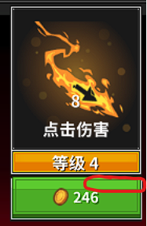

Idle Champions
ahk_class UnityWndClass
ahk_exe IdleDragons.exe
ahk_pid 36912
ahk_id 199760

// green `
Screen:	282, 1387
Window:	-884, 1355
Client:	-884, 1355 (default)
Color:	5CCB2F (Red=5C Green=CB Blue=2F)

// green f1
Screen:	429, 1384
Window:	-737, 1352
Client:	-737, 1352 (default)
Color:	5CCB2F (Red=5C Green=CB Blue=2F)

// blue f2
Screen:	603, 1385
Window:	-563, 1353
Client:	-563, 1353 (default)
Color:	5CABF7 (Red=5C Green=AB Blue=F7)

格子宽度 大致 173

#sym:ButtonCoords  数组中，格子宽度173， 从第二个开始= 280+173； 第三个 280+173*2